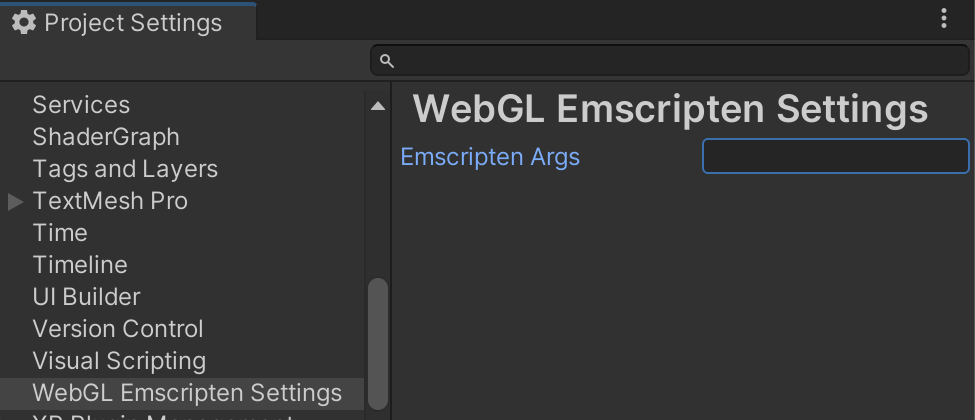

# WebGL Emscripten Settings
Unity Project Settings tab that shows and allows editing [emscripten](https://docs.unity3d.com/Manual/webgl-native-plugins-with-emscripten.html) arguments used when building WebGL projects (`PlayerSettings.WebGL.emscriptenArgs`).

